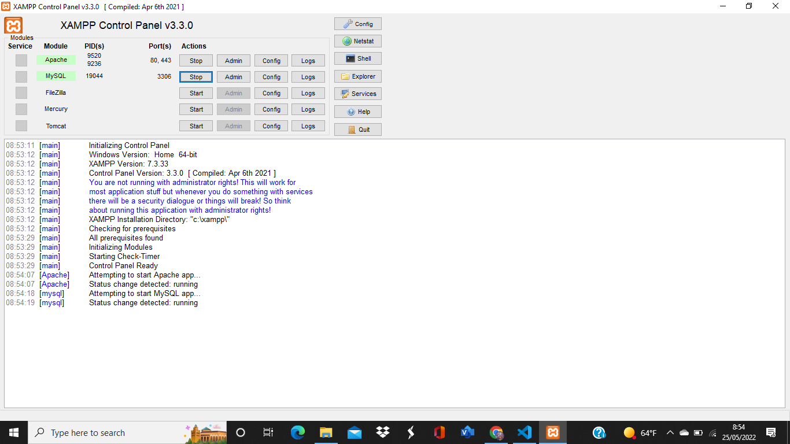
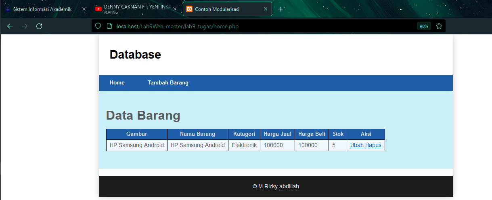
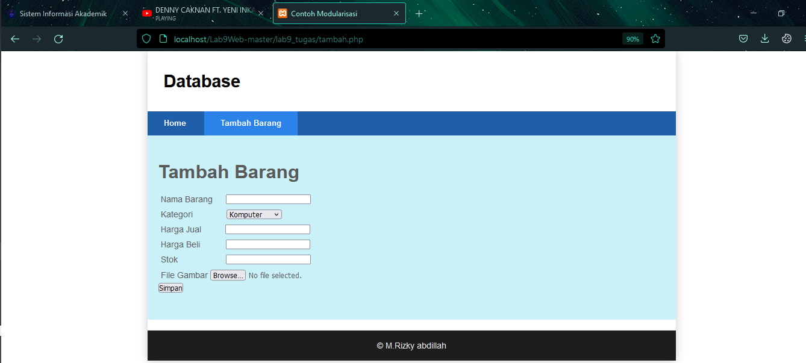
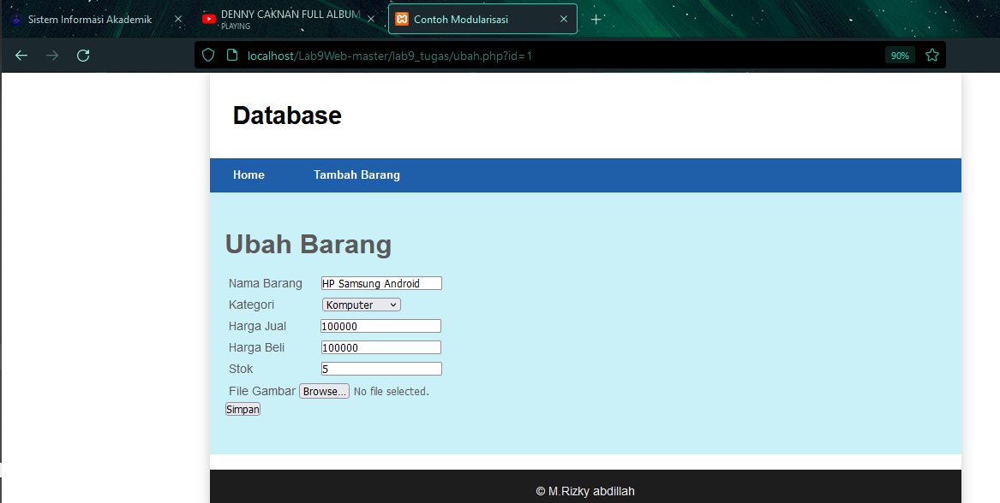

# Tugas Lab 9 Web
## Profil
| # | Biodata |
| -------- | --- |
| **Nama** | Muhammad Rizky Abdillah|
| **NIM** | 312010386 |
| **Kelas** | TI.20.A.2 |
| **Mata Kuliah** | Pemrograman Web |

# Praktikum 9: PHP Modular
## Intruksi Praktikum
1. Persiapkan text editor misalnya VSCode.
2. Buat folder baru dengan nama lab9_php_modular pada docroot webserver
(htdocs)
3. Ikuti langkah-langkah praktikum yang akan dijelaskan berikutnya.

# Langkah praktikum
* Jalankan `XAMPP SERVER`
# Buat Nama File baru dengan nama header.php

```
<!DOCTYPE html>
<html lang="en">
<head>
    <meta charset="UTF-8">
    <title>Contoh Modularisasi</title>
    <link href="style.css" rel="stylesheet" type="text/stylesheet" media="screen" />
</head>
<body>
    <div class="container">
        <header>
            <h1>Modularisasi Menggunakan Require</h1>
        </header>
        <nav>
            <a href="home.php">Home</a>
            <a href="about.php">Tentang</a>
            <a href="kontak.php">Kontak</a>
        </nav>
```

# Buat file baru dengan nama footer.php

```
    <footer>
        <p>&copy; 2021, Informatika, Universitas Pelita Bangsa</p>
    </footer>
    </div>
</body>
</html>
```

# Buat nama file baru dengan nama home.php
```
<?php require('header.php'); ?>
    <div class="content">
    <h2>Ini Halaman Home</h2>
    <p>Ini adalah bagian content dari halaman.</p>
</div>
<?php require('footer.php'); ?>
```
* Require ialah  require berarti butuh, artinya kita butuh file tersebut, sehingga jika file tersebut tidak ada maka script selanjutnya tidak akan berjalan.
# Buat file baru dengan nama about.php
```
<?php require('header.php'); ?>
    <div class="content">
        <h2>Ini Halaman About</h2>
        <p>Ini adalah bagian content dari halaman.</p>
    </div>
<?php require('footer.php'); ?>
```
# Pertanyaan dan tugas

* Implementasikan konsep modularisasi pada kode program praktikum 8 tentang database, sehingga setiap halamannya memiliki template tampilan yang sama. Laporan Praktikum

1. Jalankan `XAMPP SERVER`


lalu buatlah kodingan sql
2. Membuat Database
```
CREATE DATABASE latihan1;
```

3. Membuat Tabel
```
CREATE TABLE data_barang (
 id_barang int(10) auto_increment Primary Key,
 kategori varchar(30),
 nama varchar(30),
 gambar varchar(100),
 harga_beli decimal(10,0),
 harga_jual decimal(10,0),
 stok int(4)
);
```


4. Menambahkan Data
```
INSERT INTO data_barang (kategori, nama, gambar, harga_beli, harga_jual, stok)
VALUES ('Elektronik', 'HP Samsung Android', 'hp_samsung.jpg', 2000000, 2400000, 5),
('Elektronik', 'HP Xiaomi Android', 'hp_xiaomi.jpg', 1000000, 1400000, 5),
('Elektronik', 'HP OPPO Android', 'hp_oppo.jpg', 1800000, 2300000, 5);
```
* klik menu sql lalu salin code sql ini..

5. Buat file name bernama koneksi.php
```
<?php
$host = "localhost";
$user = "root";
$pass = "";
$db = "latihan1";
$conn = mysqli_connect($host, $user, $pass, $db);

if ($conn == false)
{
    echo "Koneksi ke server gagal.";
    die();
} #else echo "Koneksi berhasil";
?>
```
6. lalu buat file name header.php
```
<?php
include("koneksi.php");

// query untuk menampilkan data
$sql = 'SELECT * FROM data_barang';
$result = mysqli_query($conn, $sql);
?>

<!DOCTYPE html>
<html lang="en">
<head>
    <meta charset="UTF-8">
    <title>Contoh Modularisasi</title>
    <link href="style.css" rel="stylesheet" type="text/css" />
</head>
<body>
    <div id="container">
        <header>
            <h1>Database</h1>
        </header>
        <nav>
            <a href="home.php">Home</a>
            <a href="tambah.php">Tambah Barang</a>
        </nav>
```
7. Buat file baru dengan nama footer.php
```
<footer>
            <p>&copy; M.Rizky Abdillah</p>
        </footer>
    </div>
</body>
</html>
```
8. buat file baru dengan nama home.php
```
<?php require('header.php'); ?>
<div class="content">
    <h1>Data Barang</h1>
    <div class="main">
        <table>
       <tr>
            <th>Gambar</th>
            <th>Nama Barang</th>
            <th>Katagori</th>
            <th>Harga Jual</th>
            <th>Harga Beli</th>
            <th>Stok</th>
            <th>Aksi</th>
        </tr>
        <?php if($result): ?>
        <?php while($row = mysqli_fetch_array($result)): ?>
        <tr>
            <td>" alt="<?=$row['nama'];?>"></td>
            <td><?= $row['nama'];?></td>
            <td><?= $row['kategori'];?></td>
            <td><?= $row['harga_jual'];?></td>
            <td><?= $row['harga_beli'];?></td>
            <td><?= $row['stok'];?></td>
            <td>
                <a href="ubah.php?id=<?= $row['id_barang'];?>">Ubah</a>
                <a href="hapus.php?id=<?= $row['id_barang'];?>">Hapus</a> 
            </td>
        </tr>
        <?php endwhile; else: ?>
        <tr>
            <td colspan="7">Belum ada data</td>
        </tr>
        <?php endif; ?>
        </table>
    </div>
</div>

<?php require('footer.php'); ?>
```
9. lalu buatlah file baru dengan nama tambah.php
```
<?php
error_reporting(E_ALL);
include_once 'koneksi.php';

if (isset($_POST['submit']))
{
    $nama = $_POST['nama'];
    $kategori = $_POST['kategori'];
    $harga_jual = $_POST['harga_jual'];
    $harga_beli = $_POST['harga_beli'];
    $stok = $_POST['stok'];
    $file_gambar = $_FILES['file_gambar'];
    $gambar = null;

    if ($file_gambar['error'] == 0)
    {
        $filename = str_replace(' ', '_',$file_gambar['name']);
        $destination = dirname(__FILE__) .'/gambar/' . $filename;
        if(move_uploaded_file($file_gambar['tmp_name'], $destination))
        {
            $gambar = 'gambar/' . $filename;;
        }
    }
    
    $sql = 'INSERT INTO data_barang (nama, kategori, harga_jual, harga_beli, stok, gambar) ';
    $sql .= "VALUE ('{$nama}', '{$kategori}','{$harga_jual}','{$harga_beli}', '{$stok}', '{$gambar}')";
    $result = mysqli_query($conn, $sql);
    header('location: home.php');
}
?>

<?php require('header.php'); ?>

<div class="content">
    <h1>Tambah Barang</h1>
    <div class="main">
        <form method="post" action="tambah.php" enctype="multipart/form-data">
            <div class="input">
                <label>Nama Barang</label>
                <input type="text" name="nama" style="margin-left: 20px;" />
            </div>
            <div class="input">
                <label>Kategori</label>
                <select name="kategori" style="margin-left: 58px;" >
                    <option value="Komputer">Komputer</option>
                    <option value="Elektronik">Elektronik</option>
                    <option value="Hand Phone">Hand Phone</option>
                </select>
            </div>
            <div class="input">
                <label>Harga Jual</label>
                <input type="text" name="harga_jual" style="margin-left: 40px;" />
            </div>
            <div class="input">
                <label>Harga Beli</label>
                <input type="text" name="harga_beli" style="margin-left: 43px;" />
            </div>
            <div class="input">
                <label>Stok</label>
                <input type="text" name="stok" style="margin-left: 85px;" />
            </div>
            <div class="input">
                <label>File Gambar</label>
                <input type="file" name="file_gambar" />
            </div>
            <div class="submit">
                <input type="submit" name="submit" value="Simpan" />
            </div>
        </form>
    </div>
</div>

<?php require('footer.php'); ?>
```
10. buatlah file baru dengan nama ubah.php
```
<?php
error_reporting(E_ALL);
include_once 'koneksi.php';

if (isset($_POST['submit']))
{
    $id = $_POST['id'];
    $nama = $_POST['nama'];
    $kategori = $_POST['kategori'];
    $harga_jual = $_POST['harga_jual'];
    $harga_beli = $_POST['harga_beli'];
    $stok = $_POST['stok'];
    $file_gambar = $_FILES['file_gambar'];
    $gambar = null;

    if ($file_gambar['error'] == 0)
    {
        $filename = str_replace(' ', '_', $file_gambar['name']);
        $destination = dirname(__FILE__) . '/gambar/' . $filename;
        if (move_uploaded_file($file_gambar['tmp_name'], $destination))
        {
            $gambar = 'gambar/' . $filename;;
        }
    }

    $sql = 'UPDATE data_barang SET ';
    $sql .= "nama = '{$nama}', kategori = '{$kategori}', ";
    $sql .= "harga_jual = '{$harga_jual}', harga_beli = '{$harga_beli}', stok = '{$stok}' ";
    if (!empty($gambar))
        $sql .= ", gambar = '{$gambar}' ";
    $sql .= "WHERE id_barang = '{$id}'";
    $result = mysqli_query($conn, $sql);

    header('location: home.php');
    }

    $id = $_GET['id'];
    $sql = "SELECT * FROM data_barang WHERE id_barang = '{$id}'";
    $result = mysqli_query($conn, $sql);
    if (!$result) die('Error: Data tidak tersedia');
    $data = mysqli_fetch_array($result);

    function is_select($var, $val) {
        if ($var == $val) return 'selected="selected"';
        return false;
}
?>

<?php require('header.php'); ?>

<div class="content">
    <h1>Ubah Barang</h1>
    <div class="main">
        <form method="post" action="ubah.php" enctype="multipart/form-data">
            <div class="input">
                <label>Nama Barang</label>
                <input type="text" name="nama" value="<?php echo $data['nama'];?>" style="margin-left: 20px;"/>
            </div>
            <div class="input">
                <label>Kategori</label>
                <select name="kategori" style="margin-left: 58px;">
                    <option <?php echo is_select ('Komputer', $data['kategori']);?> value="Komputer">Komputer</option>
                    <option <?php echo is_select ('Komputer', $data['kategori']);?> value="Elektronik">Elektronik</option>
                    <option <?php echo is_select ('Komputer', $data['kategori']);?> value="Hand Phone">Hand Phone</option>
                </select>
            </div>
            <div class="input">
                <label>Harga Jual</label>
                <input type="text" name="harga_jual" value="<?php echo $data['harga_jual'];?>" style="margin-left: 40px;"/>
            </div>
            <div class="input">
                <label>Harga Beli</label>
                <input type="text" name="harga_beli" value="<?php echo $data['harga_beli'];?>" style="margin-left: 43px;"/>
            </div>
            <div class="input">
                <label>Stok</label>
                <input type="text" name="stok" value="<?php echo $data['stok'];?>" style="margin-left: 85px;"/>
            </div>
            <div class="input">
                <label>File Gambar</label>
                <input type="file" name="file_gambar" />
            </div>
            <div class="submit">
                <input type="hidden" name="id" value="<?php echo $data['id_barang'];?>" />
                    <input type="submit" name="submit" value="Simpan" />
            </div>
        </form>
    </div>
</div>

<?php require('footer.php'); ?>
```
11. Buatlah file dengan nama hapus.php
```
<?php
include_once 'koneksi.php';
$id = $_GET['id'];
$sql = "DELETE FROM data_barang WHERE id_barang = '{$id}'";
$result = mysqli_query($conn, $sql);
header('location: home.php');
?>
```

12. lalu tambahkan css nya agar terlihat lebih menarik dengan nama `style,css`
```
/* import google font */
@import
url('https://fonts.googleapis.com/css2?family=Open+Sans:ital,wght@0,300;0,400;0,600;0,700;0,800;1,300;1,400;1,600;1,700;1,800&display=swap');
@import
url('https://fonts.googleapis.com/css2?family=Open+Sans+Condensed:ital,wght@0,300;0,700;1,300&display=swap');

/* Reset CSS */
* {
    margin: 0;
    padding: 0;
}
body {
    line-height:1;
    font-size:100%;
    font-family:'Open Sans', sans-serif;
    color:#5a5a5a;
}
#container {
    width: 980px;
    margin: 0 auto;
    box-shadow: 0 0 1em #cccccc;
}

/* header */
header {
    padding: 20px;
}
header h1 {
    margin: 20px 10px;
    color: black;
}

/* navigasi */
nav {
    display: block;
    background-color: #1f5faa;
}
nav a {
    padding: 15px 30px;
    display: inline-block;
    color: #ffffff;
    font-size: 14px;
    text-decoration: none;
    font-weight: bold;
}
nav a.active,
nav a:hover {
    background-color: #2b83ea;
}

/* Content Panel */
.content {
    background-color: #caf0f8;
    padding: 50px 20px;
    margin-bottom: 20px;
}
.content h1 {
    margin-bottom: 20px;
    font-size: 35px;
}
.content p {
    margin-bottom: 20px;
    font-size: 18px;
    line-height: 25px;
}

/* footer */
footer {
    clear:both;
    background-color:#1d1d1d;
    padding:20px;
    color:#eee;
    text-align: center;
}

/* tabel */
body{
    font-family: sans-serif;
}
table{
    border-collapse: collapse;
}
th, td{
    border: 1px solid black;
    font-size: 16px;
    padding: 7px 9px;
}
table th {
    background:#1f5faa;
    color:#DCDCDC;
    font-weight:bold;
    font-size:14px;
}
table tr:nth-child(even) {
    background:#F0F8FF;
}

/* Tambah Barang */
.input{
    padding: 5px;
}
```
# lalu hasilnya berikut ini
1. ini bagian tampilan pada menu `home.php` 

2. Tampilan bagian tambah barang `tambah.php`

3. Tampilan bagian ubah barang `ubah.php`



# database, sehingga setiap halamannya memiliki template tampilan yang sama. Laporan Praktikum
1. Buatlah repository baru dengan nama Lab9Web. 
2. Kerjakan semua latihan yang diberikan sesuai urutannya. 
3. Screenshot setiap perubahannya. 
4. Buatlah file README.md dan tuliskan penjelasan dari setiap langkah praktikum
beserta screenshotnya. 
5. Commit hasilnya pada repository masing-masing.